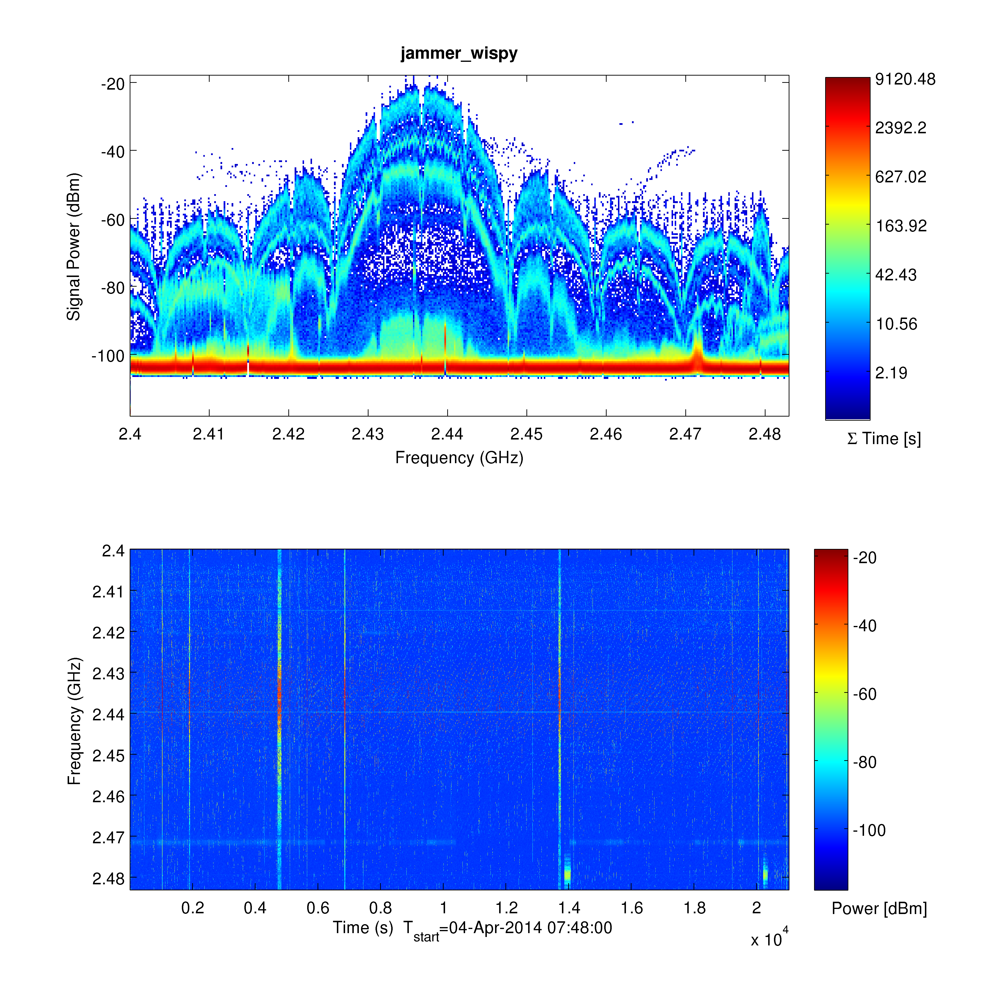

# CREWCDF Toolbox

CREW Common Data Format Matlab toolbox

## Installation

To LOAD the toolbox run `crewcdf_toolbox_load.m` like this:

    run(['<crewcdf_toolbox_folder>' filesep 'crewcdf_toolbox_load.m']);

To INSTALL the toolbox load it and save path by either `File>Save Path...` and than save or by savepath command.
You can also add the above line to your `startup.m` file.

## Usage

It is possible to make a summary plots of all data files in the given directory and it's subdirectories:

    crewcdf_plotall();

This function uses most of the toolbox functionalities and provides the following summary plot for all files that where successfully processed.
For more information we refer to particular help functions.

### Known Issues

#### Linux font problems in plots are too small.

Install xfonts packages with the following command. Then logout and login from your session to get the font list updated.

    sudo apt-get install xfonts-100dpi xfonts-75dpi

#### Use Matlab >2013a

The toolbox uses read functions that only appeared in 2013a version. However, it is possible to get the missing functions from file exchange.

## Acknowledgements

The research leading to these results has received funding from the
European Union's Seventh Framework Programme (FP7/2007-2013) under grant agreement n°`258301` ([CREW project](http://www.crew-project.eu/)).
